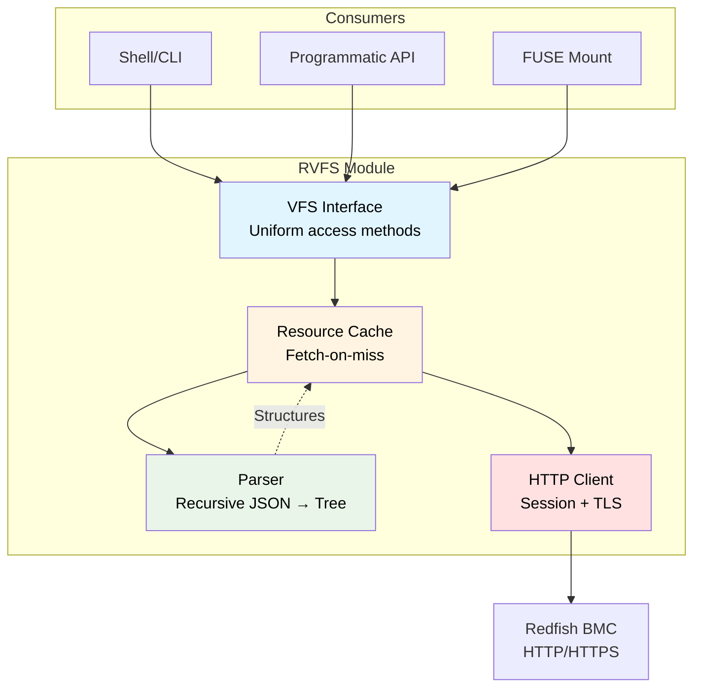
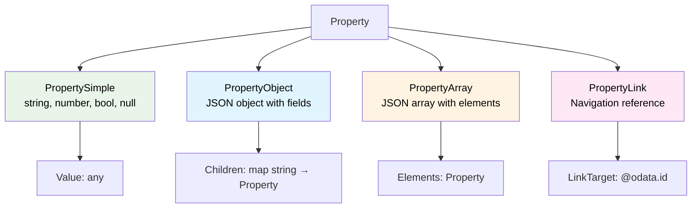
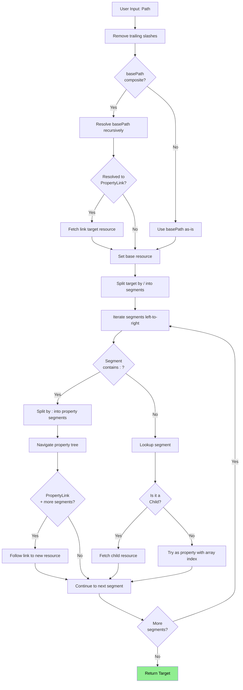
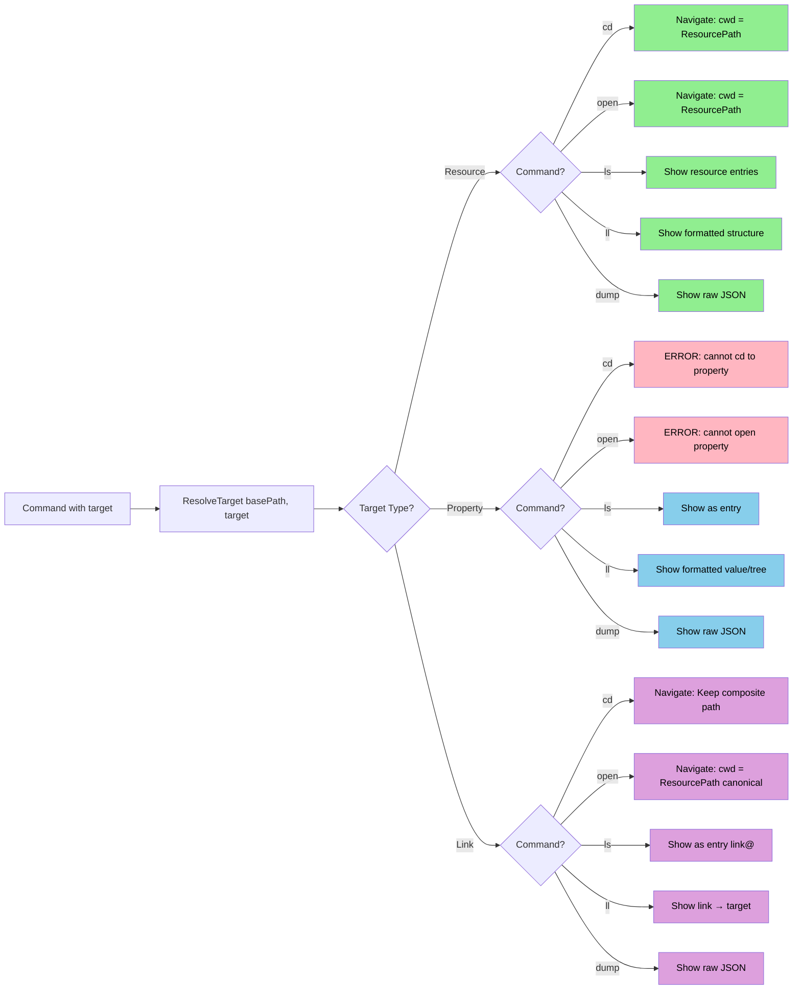

# RVFS Data Model & Navigation Architecture

**RVFS** (Redfish Virtual FileSystem) is a backend module providing structured access to Redfish APIs through a filesystem-like abstraction. It supports multiple consumers: interactive shells, programmatic APIs, and future FUSE mounts.

## Table of Contents
- [Core Principles](#core-principles)
- [Architecture](#architecture)
- [Property Types](#property-types)
- [Path Addressing](#path-addressing)
- [Navigation & Resolution](#navigation--resolution)
- [Parser Implementation](#parser-implementation)
- [Examples](#examples)

---

## Core Principles

### 1. Structural Fidelity
The Parser preserves the exact JSON structure from Redfish responses:
- Properties remain properties, even if they contain navigable links
- No "elevation" or restructuring of nested items
- Complete recursive parsing builds a full property tree

### 2. Flexible Navigation
Any combination of path components creates valid composite paths:
- Resource paths use `/` separator (HTTP space)
- Property paths use `:` separator (JSON space)
- Array indexing uses `[n]` notation
- All combinations work uniformly across commands
- Trailing slashes are ignored (filtered during resolution)

### 3. Clean Encapsulation
- **Parser**: Does ALL JSON parsing, builds structured trees (one-time cost)
- **Cache**: Stores parsed structures, fetch-on-miss
- **VFS**: Provides uniform interface, no JSON parsing
- **Consumers**: Use structured data, never touch raw JSON

### 4. Two Path Spaces
| Space | Separator | Backend | Operations | HTTP? |
|-------|-----------|---------|------------|-------|
| Resource (URL) | `/` | HTTP endpoints | cd, open, GET, PATCH | Yes (if not cached) |
| Property (JSON) | `:` | JSON fields | ls, ll, dump | Never |

**Critical Rule**: Property paths (containing `:`) NEVER trigger HTTP requests.

---

## Architecture



### Data Flow

1. **Consumer** requests data via VFS interface
2. **VFS** translates request to cache operation
3. **Cache** checks if resource exists:
   - If cached: Return parsed structure
   - If not: Client fetches → Parser parses → Cache stores → Return
4. **Consumer** receives structured data (no JSON parsing needed)

---

## Property Types

Properties form a recursive tree structure. The Parser determines type during parsing.



### Property Structure Fields

Each Property contains:
- **Name**: Field name in JSON
- **Type**: PropertySimple, PropertyObject, PropertyArray, or PropertyLink
- **Value**: For PropertySimple - the Go value (string, float64, bool, nil)
- **LinkTarget**: For PropertyLink - the @odata.id URL
- **Children**: For PropertyObject - map of nested Property structures
- **Elements**: For PropertyArray - slice of Property structures
- **RawJSON**: Original JSON bytes for this property (always present)

### Type Determination Rules

| JSON | Condition | Type |
|------|-----------|------|
| `"string"`, `123`, `true`, `null` | Primitive value | PropertySimple |
| `{"@odata.id": "..."}` | Object with ONLY `@` prefixed keys | PropertyLink |
| `{"field": "value"}` | Object with regular keys | PropertyObject |
| `[1, 2, 3]` | Array | PropertyArray |

### PropertyLink vs Child

**Child**: Top-level links (objects with ONLY @odata.* keys)
```json
{
  "Chassis": {"@odata.id": "/redfish/v1/Chassis/1"},
  "Storage": {"@odata.id": "/redfish/v1/Systems/1/Storage"}
}
```
→ Both are Children (ChildLink or ChildSymlink), navigable with `cd` or `open`

**PropertyLink**: Nested links within property objects
```json
{
  "Boot": {
    "BootOrder": ["Pxe", "Hdd"],
    "BootSourceOverrideTarget": {
      "@odata.id": "/redfish/v1/Systems/1/BootOptions/Pxe"
    }
  }
}
```
→ `Boot` is PropertyObject, `Boot:BootSourceOverrideTarget` is PropertyLink (nested)

**Members**: Special case for collection items
```json
{
  "Members": [
    {"@odata.id": "/redfish/v1/Systems/1"},
    {"@odata.id": "/redfish/v1/Systems/2"}
  ]
}
```
→ Parser creates Children["1"] and Children["2"]

**Rationale**:
- Top-level links are Children (navigable like directories)
- Nested links within properties are PropertyLinks (preserve structure)
- Members arrays become Children (represent collection items)

---

## Path Addressing

### Composite Path Format

```
[resource-path][:property-path]
```

**Resource path**: Optional, uses `/` separator
**Property path**: Optional, uses `:` separator and `[n]` for arrays

### Path Examples

| Path | Type | Components |
|------|------|------------|
| `/redfish/v1/Systems/1` | Resource | Resource only |
| `Status:Health` | Property | Property only (relative) |
| `/redfish/v1/Systems/1/Status:Health` | Composite | Resource + property |
| `Boot:BootOrder[0]` | Property | Property with array index |
| `Storage` | Ambiguous | Could be child or property |
| `/redfish/v1/Systems/1/Boot:BootSourceOverrideTarget` | Composite | Nested property link |
| `Links:Drives[0]/Name` | Composite | Link + continuation |

### Path Resolution



**Key improvements**:
- Composite basePath support: Handles cases like `cd Links:Drives[0]` where cwd is composite
- Trailing slash normalization: `path/` and `path` are identical
- Array index support in property names: `prop[0]` works in `/` separated paths

### Special Paths

| Path | Meaning | Context |
|------|---------| --------|
| `.` | Current resource/location | All commands |
| `..` | Parent resource | Resource space |
| `~` | Root (`/redfish/v1`) | Resource space |
| `/` | Absolute path prefix | Resource space |
| `:` | Property separator | Property space |
| `[n]` | Array index | Property space |

---

## Navigation & Resolution

### Target Types

Every path resolves to one of three target types:

| Type | Description | Contains |
|------|-------------|----------|
| **TargetResource** | A Redfish resource (has @odata.id) | Resource, ResourcePath |
| **TargetProperty** | A non-link property (simple, object, array) | Resource, Property |
| **TargetLink** | A PropertyLink (navigable property) | Resource, Property, ResourcePath |

The Target structure contains:
- **Type**: One of the three types above
- **Resource**: The resource we're currently in
- **Property**: If Type is Property or Link, the Property structure
- **ResourcePath**: For Resources and Links, the canonical resource path (or link target)

### Resolution Algorithm

The resolver uses **iterative left-to-right processing**:

1. **Normalize basePath**: If composite, resolve it recursively and follow PropertyLinks to get the actual resource
2. **Split target by `/`** into segments (filtering empty ones)
3. **For each segment**, process left-to-right:
   - If segment contains `:`, split by `:` into property segments
   - Otherwise, look up the segment (could be child or property with array index)
4. **For each lookup**:
   - In resource space: check Children first, then Properties (with array indexing)
   - In property space: navigate through property tree
   - If we land on PropertyLink with more segments, follow the link

**Resolution Examples**:

```
Systems/1/Status:Health
├─ "Systems" → fetch child resource (Systems collection)
├─ "1" → fetch child resource (System 1)
└─ "Status:Health" → split by : → ["Status", "Health"]
   ├─ "Status" → lookup property in System 1
   └─ "Health" → navigate into Status property

Systems/@Redfish.CollectionCapabilities:Capabilities[0]
├─ "Systems" → fetch child resource
└─ "@Redfish.CollectionCapabilities:Capabilities[0]" → split by :
   ├─ "@Redfish.CollectionCapabilities" → lookup property
   └─ "Capabilities[0]" → navigate into property, access array element 0

Links:Drives[0]/Name
├─ "Links:Drives[0]" → split by :
│  ├─ "Links" → property lookup → PropertyObject
│  └─ "Drives[0]" → property lookup → PropertyArray, element 0 → PropertyLink
│      → follow link to /redfish/v1/.../Drive
└─ "Name" → property lookup in Drive resource
```

**Key insight**: Each separator has specific semantics:
- `/` separates resource path segments (may fetch new resources)
- `:` separates property path segments (navigates within JSON objects)
- `[n]` indexes into arrays (navigates to specific array elements)

The type of each entity determines what operations are valid.

### Command Behavior

| Command | TargetResource | TargetProperty | TargetLink |
|---------|----------------|----------------|------------|
| `cd` | Navigate to resource<br/>Keep composite if from composite path | ERROR<br/>"cannot cd to property" | Keep composite path<br/>(cwd becomes composite) |
| `open` | Navigate to resource | ERROR<br/>"cannot open property" | Follow link, canonicalize<br/>(cwd becomes resolved path) |
| `ls` | Show children & properties | Show as entry | Show as entry (link indicator) |
| `ll` | Show formatted structure | Show formatted value/tree | Show "link → target" |
| `dump` | Show raw JSON | Show raw JSON | Show raw JSON |

**Special behaviors**:
- `cd .` - No-op, prints current location summary
- `open .` - Canonicalizes current composite path to actual resource path
- `cd ..` - Navigate to parent resource

### Decision Tree



---

## Parser Implementation

### Recursive Parsing Strategy

The Parser uses jsonparser's visitor pattern to recursively build the property tree in a single pass.

**High-level flow**:
1. Extract @odata.id and @odata.type from top level
2. Iterate all top-level JSON keys
3. Skip @odata.* metadata fields
4. Special case: "Members" array → extract as Children
5. Objects with ONLY @-prefixed keys → Child (link)
6. Everything else → parse as Property (recursive)

**Property parsing (recursive)**:
- **Object**: Check if link-only (only @ keys with @odata.id)
  - If yes: PropertyLink
  - If no: PropertyObject, recurse into children (skip @ keys)
- **Array**: PropertyArray, recurse into elements with `[n]` names
- **Primitive**: PropertySimple, store parsed Go value

**Link detection**: `isLinkOnly()` checks:
1. Has @odata.id field
2. All keys start with `@`

### Parsing Guarantees

1. **Single pass**: Parse entire tree in one traversal
2. **No re-parsing**: Property tree cached, reused for all queries
3. **Type safety**: All properties have known types
4. **Metadata preserved**: RawJSON available for serialization
5. **Link detection**: Navigable properties identified during parse

---

## Examples

### Example 1: Nested Property Inspection

**Resource**: `/redfish/v1/Systems/1`

**JSON**:
```json
{
  "@odata.id": "/redfish/v1/Systems/1",
  "Status": {
    "Health": "OK",
    "State": "Enabled",
    "Conditions": []
  }
}
```

**Commands**:
```bash
$ ls Status
Health     State     Conditions

$ ll Status:Health
OK

$ ll Status
Status:
  Conditions: []
  Health: OK
  State: Enabled

$ dump Status
{
  "Health": "OK",
  "State": "Enabled",
  "Conditions": []
}

$ cd Status
Error: cannot cd to property: Status
```

**HTTP calls**: ZERO (after initial resource fetch)

---

### Example 2: Navigating Property Links

**Resource**: `/redfish/v1/Systems/1`

**JSON**:
```json
{
  "@odata.id": "/redfish/v1/Systems/1",
  "Boot": {
    "BootOrder": ["Pxe", "Hdd"],
    "BootSourceOverrideTarget": {
      "@odata.id": "/redfish/v1/Systems/1/BootOptions/Pxe"
    }
  },
  "Storage": {
    "@odata.id": "/redfish/v1/Systems/1/Storage"
  }
}
```

**Commands**:
```bash
$ ls Boot
BootOrder*    BootSourceOverrideTarget@

$ ll Boot:BootOrder
BootOrder:
  - Pxe
  - Hdd

$ ll Boot:BootOrder[1]
Hdd

$ dump Boot:BootOrder[1]
"Hdd"

$ cd Storage
# Storage is a top-level Child
# Navigates to /redfish/v1/Systems/1/Storage
# HTTP GET triggered
/redfish/v1/Systems/1/Storage>

$ cd /redfish/v1/Systems/1
/redfish/v1/Systems/1> cd Boot:BootSourceOverrideTarget
# Boot:BootSourceOverrideTarget is a nested PropertyLink
# cwd becomes composite path (keeps navigation context)
/redfish/v1/Systems/1/Boot:BootSourceOverrideTarget>

$ open Boot:BootSourceOverrideTarget
# Explicitly follow link to canonical destination
# HTTP GET triggered if not cached
/redfish/v1/Systems/1/BootOptions/Pxe>
```

**HTTP calls**:
- `cd Storage` → 1 GET (Child navigation)
- `cd Boot:BootSourceOverrideTarget` → 1 GET to resolve link
- `open Boot:BootSourceOverrideTarget` → 1 GET, navigate to canonical path
- All `ls`/`ll` on properties → 0 GETs

---

### Example 3: Composite Path Navigation

**Working from a composite path**:

```bash
$ cd Systems/@Redfish.CollectionCapabilities:Capabilities[0]:Links:RelatedItem[0]
/redfish/v1/Systems/@Redfish.CollectionCapabilities:Capabilities[0]:Links:RelatedItem[0]  (6 props)

$ ll Links:ResourceBlocks
# Resolves relative to composite basePath
# basePath is resolved, link followed, then Links:ResourceBlocks accessed
Links:
  ResourceBlocks:
    - link → /redfish/v1/CompositionService/ResourceBlocks/ComputeBlock
    - link → /redfish/v1/CompositionService/ResourceBlocks/DrivesBlock

$ cd .
# Confirms current composite location
/redfish/v1/Systems/@Redfish.CollectionCapabilities:Capabilities[0]:Links:RelatedItem[0]  (6 props)

$ open .
# Canonicalizes to actual resource path
/redfish/v1/CompositionService/ResourceZones/1  (6 props)
```

**Benefits**:
- Composite paths preserve navigation context
- `open` provides escape hatch to canonical paths
- `open .` reorients you when deep in composite paths

---

### Example 4: Array Indexing

**Paths with array indexing work uniformly**:

```bash
# All these access the same element
$ ll IndicatorLED@Redfish.AllowableValues[0]
Lit

$ ll IndicatorLED@Redfish.AllowableValues:0      # ERROR - wrong syntax
$ ll IndicatorLED@Redfish.AllowableValues/0      # ERROR - wrong syntax

# Array indexing in composite paths
$ cd Links:Drives[0]
/redfish/v1/Chassis/BMC_0/Links:Drives[0]  (21 props)

$ cd Links:Drives[0]/
# Trailing slash ignored (filtered out)
/redfish/v1/Chassis/BMC_0/Links:Drives[0]  (21 props)

$ cd Links:Drives[0]/Name
# Follows link from Drives[0], accesses Name property
Error: cannot cd to property: Name
```

---

## Summary

| Aspect | Design Decision |
|--------|----------------|
| **Structure** | Parser recursively builds property tree, preserving exact JSON structure |
| **Links** | Top-level links are Children; nested links are PropertyLink; Members → Children |
| **Paths** | Composite paths (`/` + `:` + `[n]`) work uniformly across all commands |
| **HTTP** | Only resource operations trigger HTTP; property inspection is local |
| **Parsing** | One-time recursive parse; no ad-hoc JSON parsing in consumers |
| **Addressing** | Two spaces (resource/property) with clear separators and rules |
| **Navigation** | `cd` keeps composite paths; `open` canonicalizes; both work from composite basePaths |
| **Resolution** | ResolveTarget handles all path types uniformly, returns typed Target |
| **Special Paths** | `.` and `..` work naturally; `open .` canonicalizes current composite path |

This model supports current CLI use and future API/FUSE consumers with:
- ✅ Clean encapsulation (Parser does all parsing)
- ✅ Efficient access (parsed tree, no re-parsing)
- ✅ Complete inspection (any complex property listable)
- ✅ Flexible navigation (composite paths everywhere)
- ✅ Bidirectional navigation (cd for context, open for canonical)
- ✅ Future-ready (tree modifiable for PATCH operations)
