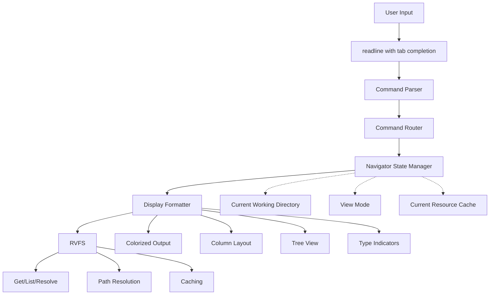
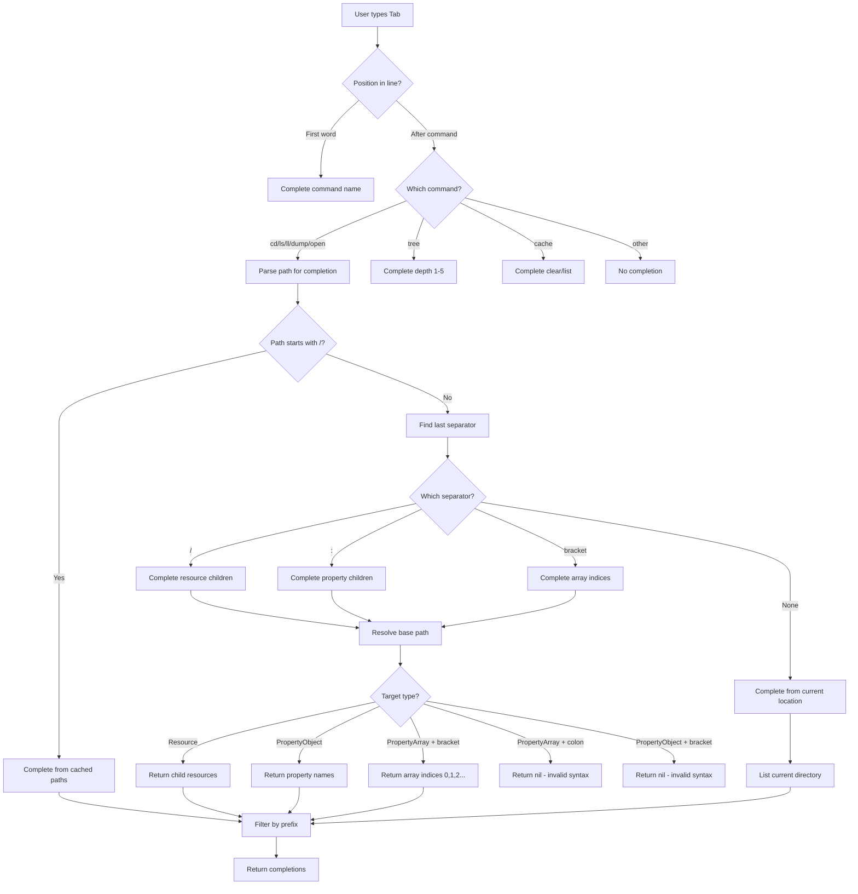
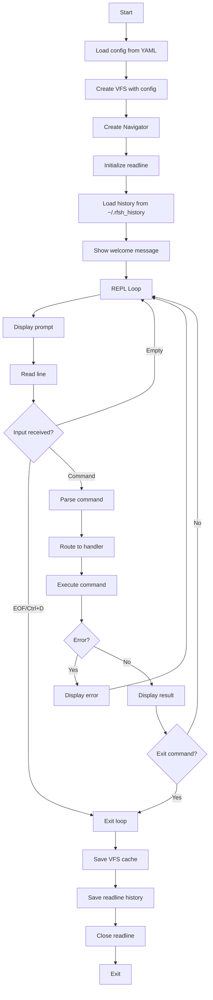

# Navigator: Redfish Shell Interface - Design Document

## Executive Summary

The Navigator is a shell-style REPL (Read-Eval-Print Loop) that provides filesystem-like commands for exploring Redfish APIs. Built on top of RVFS (Redfish Virtual FileSystem), it translates Unix shell commands into VFS operations and presents results with formatted, colorized output.

### Core Principle
**The Navigator is a thin presentation layer. It translates user commands to VFS operations and formats results for display.**

---

## Architecture Overview



### Layer Responsibilities

| Layer | Responsibility | Input | Output |
|-------|---------------|-------|--------|
| User Input | Keyboard input with history | Keystrokes | Command line string |
| Command Parser | Extract command and arguments | String | Command + args |
| Command Router | Route to handlers, validate | Command + args | Execute function |
| Navigator | Maintain state, coordinate | VFS operations | Display data |
| Display Formatter | Format and colorize | Data structures | ANSI output |
| RVFS | Data operations | Path + operation | Resources/Properties |

---

## Core Components

### Navigator State

The Navigator maintains the current session state:

| Field | Type | Purpose |
|-------|------|---------|
| vfs | RVFS | Reference to virtual filesystem |
| cwd | string | Current working directory (can be composite path) |
| currentRes | *Resource | Cached current resource for performance |
| flatView | bool | Toggle between flat and hierarchical property view |
| prompt | string | Prompt template string |

**State Initialization:**
- CWD starts at `/redfish/v1` (Redfish root)
- Flat view disabled by default (hierarchical)
- Prompt shows CWD with mode indicator

**Prompt Format:**
```
/redfish/v1>
/redfish/v1 [flat]>
/redfish/v1/Systems/@Redfish.CollectionCapabilities:Capabilities[0]>
```

### Command Registry

All commands are registered in a central map for dispatch:

| Command | Aliases | Type | Description |
|---------|---------|------|-------------|
| cd | - | Navigation | Change to resource or composite path |
| open | - | Navigation | Navigate and canonicalize composite paths |
| ls | - | Listing | List children in current location |
| ll | - | Viewing | Show formatted YAML-style content |
| pwd | - | Info | Print current working directory |
| dump | - | Viewing | Display raw JSON |
| tree | - | Viewing | Show tree view with depth control |
| find | - | Search | Search for property names/values |
| flat | - | Settings | Toggle flat property view |
| clear | - | UI | Clear screen |
| cache | - | Management | Cache operations (clear, list) |
| help | - | Info | Show command help |
| exit | quit | Control | Exit shell |

---

## Command Behaviors

### Navigation Commands

#### cd - Change Directory

**Purpose:** Navigate to a target while preserving composite paths

**Behavior:**

| Input | Action | Output |
|-------|--------|--------|
| `cd` (no args) | Navigate to /redfish/v1 | Show root with summary |
| `cd <path>` | Navigate to resource path | Show path with summary |
| `cd <composite>` | Navigate to composite path | Show composite path with summary |
| `cd .` | No-op (confirm location) | Show current path with summary |
| `cd Links:Drives` | Navigate to property-based path | Show composite path |
| `cd Links:Drives[0]` | Navigate with array indexing | Show composite path with index |
| `cd Links:Drives[0]/` | Navigate (trailing slash ignored) | Show composite path |

**Key Feature:** Never canonicalizes - preserves the user's navigation context

**Summary Format:**
```
<path>  (<count> children, <count> properties)
```

#### open - Navigate and Canonicalize

**Purpose:** Follow links and resolve to canonical resource paths

**Behavior:**

| Input | Action | Output |
|-------|--------|--------|
| `open <link>` | Navigate to link target | Show canonical path |
| `open .` | Canonicalize current composite path | Show canonical resource path |
| `open Links:Drives[0]` | Follow property link to target | Show canonical path |

**Key Difference from cd:**
- `cd` preserves composite paths for continued relative navigation
- `open` resolves to canonical resource paths for absolute context

**Example Flow:**
```
/redfish/v1/Systems> cd @Redfish.CollectionCapabilities:Capabilities[0]
/redfish/v1/Systems/@Redfish.CollectionCapabilities:Capabilities[0]> open Links:TargetCollection
/redfish/v1/Systems>
```

#### pwd - Print Working Directory

**Purpose:** Display current location

**Output:** Simply prints the current working directory (composite or canonical)

---

### Listing Commands

#### ls - List Children

**Purpose:** Show children and properties in current or specified location

**Behavior:**

| Input | Action | Output |
|-------|--------|--------|
| `ls` | List cwd entries | Columnar formatted list |
| `ls <path>` | List entries at path | Columnar formatted list |
| `ls <composite>` | List entries at composite path | Columnar formatted list |

**Output Format:**
- Multi-column layout based on terminal width
- Type indicators via color:
  - Blue with `/`: Child resources
  - Cyan with `@`: Property symlinks
  - Green: Properties
  - Purple with `*`: Complex properties

**Column Calculation:**
```
termWidth = 80  (or detected)
maxItemWidth = 15
columnWidth = maxItemWidth + 2
numColumns = termWidth / columnWidth
```

#### ll - Long Listing (YAML-style)

**Purpose:** Show detailed content of resources or properties

**Behavior:**

| Input | Target Type | Output |
|-------|-------------|--------|
| `ll` | Current resource | Full resource with properties and children |
| `ll <path>` | Resource | Full resource display |
| `ll <property>` | Property | Property value with formatting |
| `ll <composite>` | Any target | Resolved target display |
| `ll Status` | Simple property | Value only |
| `ll Links` | Object property | Nested YAML-style display |
| `ll Members[0]` | Array element | Element display |

**Resource Display Format:**
```
<resource-path>
Type: <@odata.type>

Properties:
  <name>: <value>
  <name>:
    <nested-name>: <nested-value>

Children:
  <name>/ → <target-path>
  <name>@ → <target-path>
```

**Property Display Formatting:**

| Property Type | Display |
|--------------|---------|
| Simple | `value` on same line |
| Link | `link → /target/path` |
| Object | Nested YAML-style with indentation |
| Array | YAML-style list with `- ` prefix |
| Empty Object | `{}` |
| Empty Array | `[]` |

---

### Viewing Commands

#### dump - Raw JSON Display

**Purpose:** Show unprocessed JSON from Redfish API

**Behavior:**

| Input | Output |
|-------|--------|
| `dump` | Current resource raw JSON |
| `dump <path>` | Target resource raw JSON |
| `dump <property>` | Property raw JSON (if available) |

**Format:** Indented JSON with 2-space indentation

#### tree - Tree View

**Purpose:** Hierarchical display of resource structure

**Behavior:**

| Input | Depth | Output |
|-------|-------|--------|
| `tree` | 2 (default) | Tree to depth 2 |
| `tree 3` | 3 | Tree to depth 3 |
| `tree 1` | 1 | Only immediate children |

**Tree Symbols:**
```
├── <entry>    (has more siblings)
└── <entry>    (last sibling)
│   <indent>   (parent continues)
    <indent>   (parent ended)
```

**Example Output:**
```
├── Systems/
│   ├── BMC_0/
│   └── System_0/
├── Chassis/
└── Managers/
```

#### find - Property Search

**Purpose:** Recursive search for property names matching pattern

**Behavior:**
- Case-insensitive regex matching
- Searches current resource and descendants
- Limited to depth 5 to prevent excessive traversal
- Shows property path and value

**Output Format:**
```
<property.path.name> = <value>
```

---

### Settings Commands

#### flat - Toggle View Mode

**Purpose:** Switch between flat and hierarchical property display

**Behavior:**
- Toggles `flatView` boolean
- Prints current mode status
- Re-lists current directory in new mode

**Effect on Display:**
- Hierarchical (default): Properties shown as nested structures
- Flat: All properties shown at top level with dot notation

---

### Management Commands

#### cache - Cache Operations

**Purpose:** Manage VFS resource cache

**Subcommands:**

| Subcommand | Action | Output |
|------------|--------|--------|
| `cache` (no args) | Show stats | `Cache: <N> resources` |
| `cache list` | List all cached paths | One path per line |
| `cache clear` | Clear cache | `Cache cleared` |

#### clear - Clear Screen

**Purpose:** Clear terminal display (standard ANSI clear)

---

### Help and Control

#### help - Command Help

**Purpose:** Display help information

**Behavior:**

| Input | Output |
|-------|--------|
| `help` | Full command list with keyboard shortcuts |
| `help <command>` | Specific command help |

**Help Categories:**
- Navigation commands
- Viewing commands
- Settings commands
- Control commands
- Keyboard shortcuts
- Notation guide

#### exit / quit - Exit Shell

**Purpose:** Terminate REPL session

**Behavior:**
- Saves VFS cache to disk before exit
- Closes readline
- Returns to OS shell

---

## Display Formatting

### Type Indicators and Colors

| Entry Type | Color | Suffix | Meaning |
|------------|-------|--------|---------|
| Child Link | Bold Blue | `/` | Navigable child resource |
| Symlink | Cyan | `@` | Property-based link |
| Property | Green | (none) | Simple property |
| Complex Property | Purple | `*` | Object or array property |

### ANSI Color Definitions

| Name | ANSI Code | Usage |
|------|-----------|-------|
| Bold Blue | `\e[1;34m` | Paths, child links |
| Cyan | `\e[36m` | Symlinks |
| Green | `\e[32m` | Property names |
| Purple | `\e[35m` | Complex properties |
| Yellow | `\e[33m` | Search results |
| Bold | `\e[1m` | Headers, emphasis |

### Children Summary Format

**Pattern:** `(<counts>)`

**Examples:**
- `(5 children, 12 properties)`
- `(3 children)`
- `(8 properties)`
- `(empty)`

**Logic:**
- Count ChildLink entries → "N children"
- Count PropertySymlink entries → "N properties"
- Combine with comma if both present
- Show "empty" if none

---

## Tab Completion

### Completion Flow



### Separator Semantics

The completion system treats each separator as indicating a specific navigation type:

| Separator | Meaning | Valid After | Completions Offered |
|-----------|---------|-------------|---------------------|
| `/` | Resource navigation | Resources, links | Child resources and properties |
| `:` | Property navigation | Resources, objects | Property names (object children) |
| `[` | Array indexing | Arrays | Numeric indices without brackets |

**Invalid Combinations:**
- `:` after `PropertyArray` → no completions (must use `[` for arrays)
- `[` after `PropertyObject` → no completions (must use `:` for properties)
- `[` after `PropertyLink` → no completions (links aren't indexable)

### Completion Types

| Context | Example | Strategy | Source |
|---------|---------|----------|--------|
| Command name | `c<tab>` | Prefix match | Command registry |
| Absolute path | `/redfish<tab>` | Prefix match | VFS cache (known paths) |
| Resource child | `Systems/<tab>` | Resolve base + list | Resource children |
| Property child | `Status:<tab>` | Resolve base + list | Property object children |
| Array index | `Members[<tab>` | Resolve base + list | Array element indices (bare numbers) |
| Multi-level | `Boot:BootOrder[0]:<tab>` | Resolve to element + list | Properties of array element |
| Relative path | `Sys<tab>` | Prefix match | Current directory children |
| Special paths | `.<tab>` | Static list | `.`, `..`, `~` |

### Array Index Completion

When completing after `[`, the system:
1. Resolves the base path to a `PropertyArray`
2. Returns bare numeric indices: `0`, `1`, `2`, etc. (not `[0]`, `[1]`)
3. User types `PropertyName[0` + Tab → completes to `PropertyName[0]` with closing bracket

This prevents double-bracket issues like `PropertyName[[0]]`.

### Completion Limits

- Maximum 100 results (not currently enforced)
- No network I/O (cache-only, no fetches during completion)
- Current directory children cached in navigator state

---

## REPL Integration

### Session Lifecycle



### Configuration Loading

**Config File Format (YAML):**
```yaml
endpoint: https://10.148.1.2
user: admin
pass: <password>
insecure: true
```

**Required Fields:**
- `endpoint` - Redfish service URL
- `user` - Username for authentication
- `pass` - Password for authentication

**Optional Fields:**
- `insecure` - Skip TLS certificate verification (default: false)

**Usage:**
```bash
rfsh config.yaml
```

### Readline Configuration

| Feature | Setting |
|---------|---------|
| Prompt | Dynamic from `Navigator.GetPrompt()` |
| History file | `~/.rfsh_history` |
| History limit | 1000 entries |
| History search | Enabled (folded) |
| Auto-complete | Custom completer |
| Interrupt | `^C` returns to prompt |
| EOF | `^D` triggers exit |

### Welcome Message

**Format:**
```
<initial-path>  (<summary>)
Type 'help' for commands
```

**Example:**
```
/redfish/v1  (5 children)
Type 'help' for commands
/redfish/v1>
```

---

## Error Handling

### Error Type Mapping

| RVFS Error | Navigator Display |
|------------|-------------------|
| NotFoundError | `Error: not found: <path>` |
| NotCachedError | `Error: not cached (offline mode): <path>` |
| NetworkError | `Error: network error: <path>: <details>` |
| HTTPError | `Error: HTTP <code>: <path>` |
| InvalidPathError | `Error: invalid path: <path>` |
| PropertyNotFoundError | `Error: property not found: <property>` |

### Error Display Strategy

- Errors printed to stdout with `Error:` prefix
- User remains at current location (CWD unchanged)
- REPL continues (no crashes)
- Network errors suggest cache or connectivity issues

### Graceful Degradation

| Scenario | Behavior |
|----------|----------|
| Network unavailable | Use cached resources only |
| Cache miss (offline) | Display not cached error |
| Malformed input | Display usage hint |
| Unknown command | Suggest `help` command |
| Ctrl+C during operation | Return to prompt |

---

## Keyboard Shortcuts

### Readline Bindings

| Shortcut | Action |
|----------|--------|
| `Tab` | Auto-complete current word |
| `Tab Tab` | Show all possible completions |
| `Ctrl+R` | Reverse history search |
| `Ctrl+L` | Clear screen |
| `Ctrl+A` | Jump to start of line |
| `Ctrl+E` | Jump to end of line |
| `Ctrl+W` | Delete previous word |
| `Ctrl+U` | Clear entire line |
| `Ctrl+K` | Delete from cursor to end |
| `↑` / `↓` | Navigate history |
| `Ctrl+C` | Cancel current input |
| `Ctrl+D` | Exit (EOF) |

---

## Performance Considerations

### Display Optimization

| Technique | Purpose |
|-----------|---------|
| Lazy formatting | Format data only when displaying, not when fetching |
| Terminal width detection | Dynamic column calculation based on current terminal |
| ANSI stripping for length | Calculate visible length excluding color codes |
| Sorted output | Deterministic ordering for properties and children |

### Completion Optimization

| Technique | Purpose |
|-----------|---------|
| Cache-only | No network I/O during tab completion |
| Current dir caching | Keep current resource in navigator state |
| Result limiting | Cap completions at 100 entries |
| Prefix filtering | Early rejection of non-matching paths |

### Memory Management

| Area | Strategy |
|------|----------|
| Current resource | Single cached resource in navigator |
| History | Limited to 1000 entries via readline |
| Output buffering | No buffering - stream to stdout |
| VFS cache | Managed by RVFS layer |

---

## Summary

The Navigator provides a clean, focused shell interface layer with five core responsibilities:

### 1. State Management
- Current working directory (composite or canonical)
- View mode (flat vs hierarchical)
- Cached current resource

### 2. Command Routing
- Parse user input
- Route to command handlers
- Validate arguments
- Execute VFS operations

### 3. Display Formatting
- Colorized output with type indicators
- Columnar layout for listings
- YAML-style hierarchical display
- Tree view rendering

### 4. Tab Completion
- Command name completion
- Path completion (absolute, relative, composite)
- Context-aware suggestions
- Cache-only (no network delays)

### 5. REPL Integration
- Readline with history and editing
- Config file loading
- Error handling and recovery
- Cache persistence

### Design Principle

**Navigator translates and formats. RVFS does the work.**

This separation of concerns allows RVFS to be used by other interfaces (FUSE filesystem, web UI, API scripts) while the Navigator focuses solely on providing an excellent shell experience.

The Navigator never duplicates RVFS logic - it calls VFS methods and presents results. All path resolution, caching, and data fetching happens in the RVFS layer.
