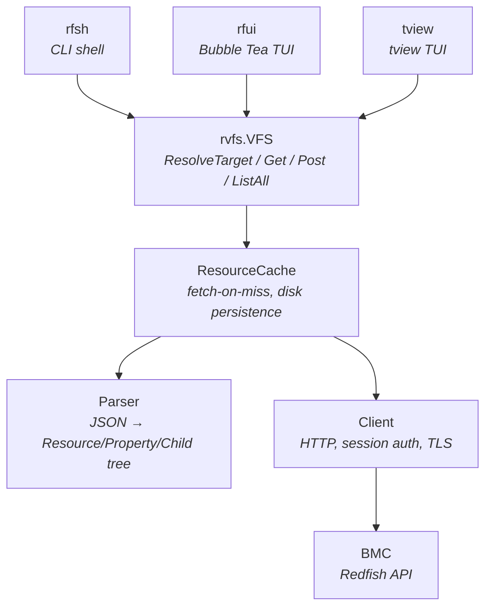
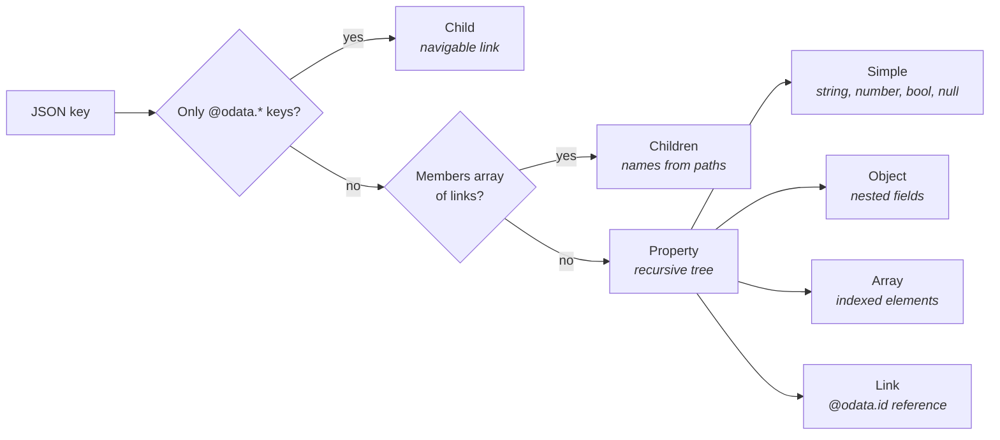
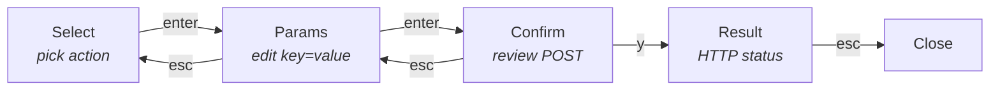

# Bluefish

Three tools for navigating Redfish BMC APIs, built on a shared virtual filesystem layer that maps Redfish JSON resources onto familiar directory/file semantics.

| Tool | Description |
|------|-------------|
| **rfsh** | Interactive shell with `cd`, `ls`, `ll`, tab completion, and action invocation |
| **rfui** | Bubble Tea TUI with tree browser, search overlay, and action modal |
| **tview** | Lightweight tview-based tree browser |

## Quick Start

```bash
go build -o rfsh ./cmd/rfsh
go build -o rfui ./cmd/rfui
go build -o tview ./cmd/tview
```

Create `config.yaml`:

```yaml
endpoint: https://10.1.2.3
user: admin
pass: your_password
insecure: true
```

```bash
./rfsh config.yaml     # Shell
./rfui config.yaml     # TUI (Bubble Tea)
./tview config.yaml    # TUI (tview)
```

## Architecture



### RVFS Data Model

The parser classifies every top-level JSON key into one of three categories:



Path resolution walks segments left to right, switching between resource mode (check Children, then Properties) and property mode (descend into property children). PropertyLinks followed mid-path trigger a fetch and re-enter resource mode.

## rfsh — Shell

### Navigation

```
cd Systems/1              Navigate to child resource
cd Status                 Navigate into property object
cd ..                     Parent
cd ~                      Root (/redfish/v1)
open Links/Chassis[0]     Follow a PropertyLink to its target
open .                    Return to containing resource from a property path
pwd                       Print working directory
```

### Viewing

```
ls                        List children and properties (columnar)
ll Status                 Formatted YAML-style output
dump                      Raw JSON
tree 3                    Tree view with depth limit
find Health               Recursive property search
```

### Actions

Enter action mode with `!` to discover and invoke Redfish POST actions:

```
!                         Enter action mode (lists available actions)
ls                        List actions
ll Reset                  Show action details and parameters
Reset ResetType=GracefulShutdown    Invoke with confirmation
!                         Exit action mode
```

### Tab Completion

Context-aware completion for resource children, property names, and array indices.

### Other

```
cache / cache list / cache clear
clear                     Clear screen
help                      Show help
```

## rfui — Bubble Tea TUI

Split-pane browser: tree (40%) on the left, scrollable details (60%) on the right. Breadcrumb bar at the top, help bar at the bottom.

```
┌─ RFUI  Subtree: /redfish/v1/Systems/1 ──────────────────────┐
│ redfish > v1 > Systems > 1                                   │
├──────── Tree ─────────┬──────────── Details ─────────────────┤
│ ▾ Status {2}          │ Path: .../Systems/1/Status           │
│   Health: "OK"        │                                      │
│   State: "Enabled"    │ Type: Object                         │
│ ▸ Boot {8}            │ Fields: 2                            │
│ ▸ Actions {2}         │   Health: "OK"                       │
│   BiosVersion: "2.1"  │   State: "Enabled"                   │
│   Assembly → ...      │                                      │
├──────────────────────────────────────────────────────────────┤
│ enter:open h/j/k/l:nav bs:back /:search !:action ?:help     │
└──────────────────────────────────────────────────────────────┘
```

### Key Bindings

| Key | Action |
|-----|--------|
| `j` / `k` | Move cursor down / up |
| `h` | Collapse node, or move to parent |
| `l` | Expand node |
| `Space` | Toggle expand/collapse |
| `Enter` | Open: rebase tree on child/link |
| `Backspace` | Back to previous root |
| `u` | Go up to parent resource |
| `~` | Go to root |
| `r` | Refresh (clear cache, re-fetch) |
| `s` | Scrape (crawl uncached resources) |
| `J` / `K` | Scroll details panel |
| `/` | Search overlay |
| `!` | Action overlay |
| `?` | Help overlay (all bindings) |
| `q` | Quit |

### Search Overlay (`/`)

Fuzzy subsequence search over all cached resource paths. Type to filter, `Ctrl+j`/`Ctrl+k` to navigate results, `Enter` to jump, `Escape` to cancel.

### Scrape (`s`)

Crawls all reachable resources from the current root, fetching anything not already in the cache. Shows a progress bar and error count in a modal. Useful for populating the cache before using search.

### Action Overlay (`!`)

Four-phase workflow for Redfish POST actions:



Tab cycles through AllowableValues for each parameter.

### Color Coding

| Color | Meaning |
|-------|---------|
| Blue | Child resources |
| Purple | Objects and arrays |
| Yellow | Links (PropertyLink) |
| Green | Property names, "OK"/"Enabled", `true` |
| Red | "Critical"/"Disabled", `false` |
| Yellow | "Warning" |
| Blue | Numbers |
| Gray | `null` |

## Path Syntax

All paths use `/` as the separator. Array elements use `[n]`.

```
/redfish/v1/Systems/1               Absolute resource path
Status/Health                        Relative property path
BootOrder[0]                         Array indexing
Oem/Supermicro/NodeManager/Id        Link-following mid-path
```

| Path | Meaning |
|------|---------|
| `.`  | Current location |
| `..` | Parent |
| `~`  | Root (`/redfish/v1`) |

`cd` navigates into resources and property objects. `open` follows PropertyLinks to their target resource.

## Project Structure

```
cmd/
  rfsh/             CLI shell
    rfsh.go           REPL, navigator, commands, action mode
    completer.go      Tab completion
  rfui/             Bubble Tea TUI
    main.go           Entry point, config
    model.go          Root model, Init/Update/View, layout
    tree.go           Flat-list tree with expand/collapse
    details.go        Scrollable property viewport
    breadcrumb.go     Path segment bar
    search.go         Fuzzy search overlay
    actions.go        Action discovery and POST workflow
    scrape.go         Resource crawler with progress bar
    help.go           Help modal content
    keys.go           Mode-sensitive key bindings
    styles.go         Lip Gloss style definitions
    messages.go       tea.Msg types
    render.go         Color-coded value formatting
  tview/            tview TUI
    main.go           Tree browser with details panel
rvfs/               Virtual filesystem library
  vfs.go              VFS interface, path resolution
  types.go            Resource, Property, Child, Target types
  parser.go           JSON → typed property tree
  cache.go            Fetch-on-miss cache with disk persistence
  client.go           HTTP client with session auth
```

## Development

```bash
go build ./...
go test ./...
go vet ./...
```

Cache files (`.rfsh_cache_<hostname>.json`) are created in the working directory and gitignored.
