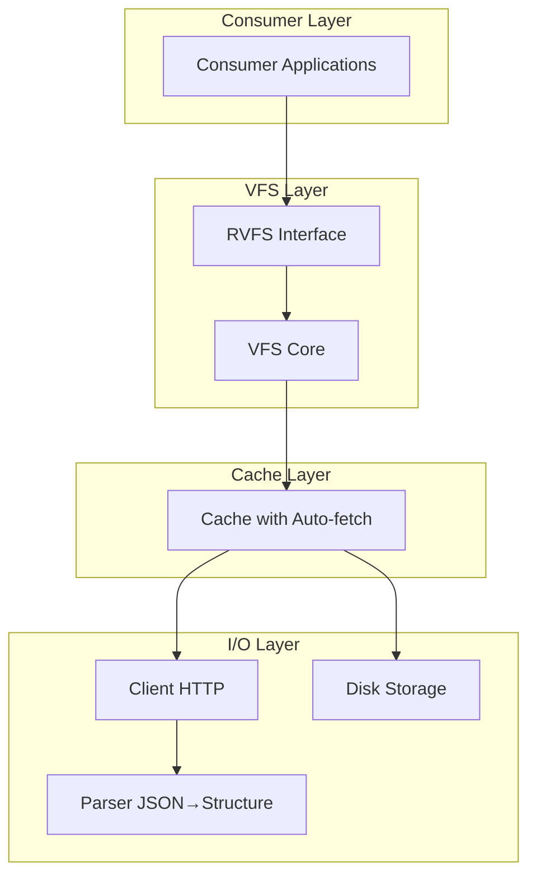
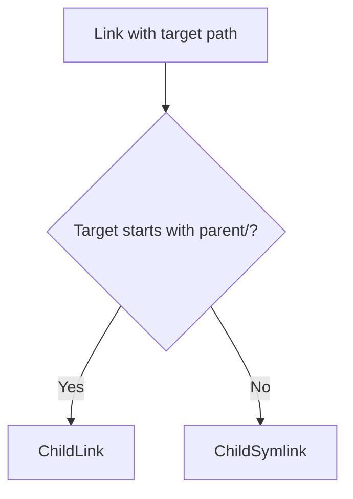
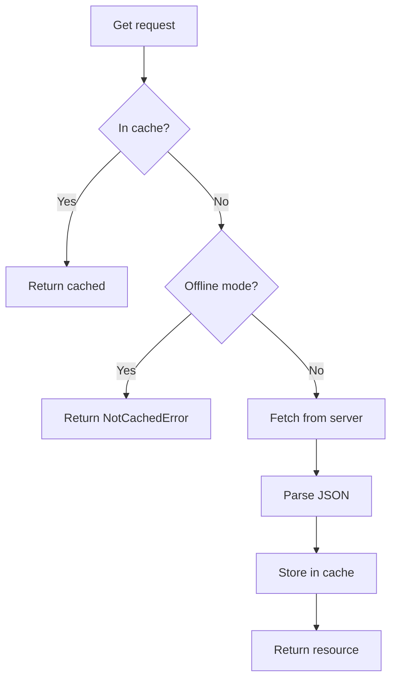
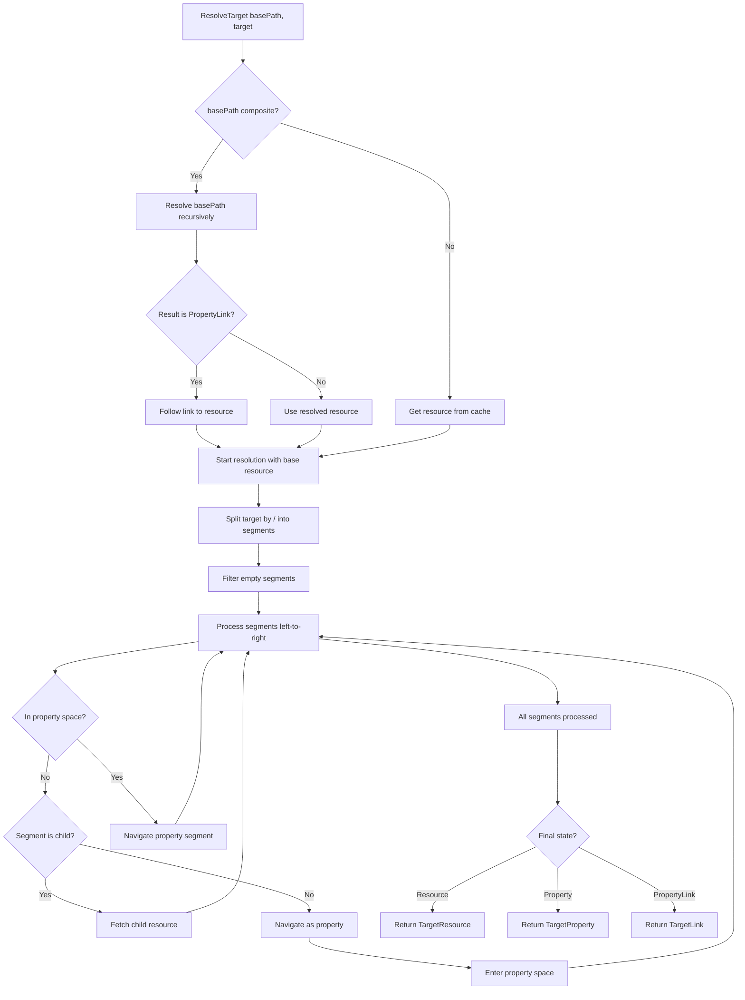

# RVFS: Redfish Virtual FileSystem - Design Document

## Executive Summary

RVFS (Redfish Virtual FileSystem) is a Go module that presents Redfish APIs as a virtual filesystem. It provides a unified abstraction layer where Redfish resources are directories, properties are files, and navigation follows standard filesystem semantics. The module handles HTTP communication, JSON parsing, and intelligent caching transparently, allowing higher-level code to interact with Redfish exactly as it would with a local filesystem.

### Core Principle
**The cache is the filesystem. All interaction goes through the VFS layer. Nothing else touches HTTP or JSON.**

---

## Architecture Overview



### Component Responsibilities

| Component | Responsibility | Inputs | Outputs |
|-----------|---------------|--------|---------|
| VFS Core | Path resolution, navigation, target resolution | Paths (canonical or composite) | Resources, Properties, Targets |
| Cache | Transparent fetch-on-miss, persistence | Resource paths | Resources with parsed structure |
| Client | HTTP communication, authentication | Redfish paths | Raw JSON bytes |
| Parser | JSON structure extraction | Raw JSON | Resource/Property structures |
| Disk Storage | Cache persistence | Cache state | JSON files |

---

## Package Structure

```
rvfs/
├── rvfs.go          # Main VFS interface, types, and ResolveTarget
├── cache.go         # Cache with auto-fetch
├── client.go        # HTTP Redfish client with TLS config
├── parser.go        # JSON parser and classifier
└── vfs_test.go      # Comprehensive tests
```

---

## Core Data Structures

### Entry Types

Entries represent items in the VFS (files, directories, links):

| Field | Type | Purpose |
|-------|------|---------|
| Name | string | Entry name (last segment of path) |
| Path | string | Full path to entry |
| Type | EntryType | Classification (see below) |
| Size | int64 | For properties: value length; for resources: JSON size |
| Modified | time.Time | Last fetch time |

**Entry Types:**

| Type | Meaning | Behavior |
|------|---------|----------|
| EntryResource | Directory | Navigable Redfish resource |
| EntryProperty | File | Simple property (string, number, bool, null) |
| EntryComplex | File | Complex property (object or array) |
| EntryLink | Directory | Child resource link |
| EntrySymlink | Symlink | External resource reference |

**Directory Test:** `EntryResource` and `EntryLink` return true for `IsDir()`

### Resource Structure

Resources represent Redfish resources at specific paths:

| Field | Type | Purpose |
|-------|------|---------|
| Path | string | Canonical path: `/redfish/v1/Systems/1` |
| ODataID | string | `@odata.id` from JSON |
| ODataType | string | `@odata.type` from JSON |
| RawJSON | []byte | Original server response |
| Properties | map[string]*Property | Parsed properties |
| Children | map[string]*Child | Navigable children |
| FetchedAt | time.Time | Cache timestamp |

**Key Methods:**
- `GetProperty(path)` - Retrieve property by name or dot path
- `GetChild(name)` - Retrieve child by name

### Property Structure

Properties represent data fields (recursively parsed):

| Field | Type | Usage |
|-------|------|-------|
| Name | string | Property name |
| Type | PropertyType | Simple, Object, Array, or Link |
| Value | interface{} | For Simple: parsed Go value |
| LinkTarget | string | For Link: `@odata.id` URL |
| Children | map[string]*Property | For Object: nested fields |
| Elements | []*Property | For Array: array items |
| RawJSON | []byte | Original JSON for this property |

**Property Types:**

| Type | Contains |
|------|----------|
| PropertySimple | string, number, bool, null |
| PropertyObject | Nested map of properties (recursive) |
| PropertyArray | Slice of properties (recursive) |
| PropertyLink | Navigation reference with `@odata.id` |

### Child Structure

Children represent navigable resources:

| Field | Type | Purpose |
|-------|------|---------|
| Name | string | Child name |
| Type | ChildType | Link or Symlink |
| Target | string | `@odata.id` path |
| Parent | string | Parent resource path |

**Child Types:**

| Type | Meaning | Example |
|------|---------|---------|
| ChildLink | Target under parent tree | `/redfish/v1/Systems` → `/redfish/v1/Systems/1` |
| ChildSymlink | Target outside parent tree | `/redfish/v1/Systems/1` → `/redfish/v1/Chassis/1` |

**External Test:** `ChildSymlink` returns true for `IsExternal()`

### Target Result Structure

Target resolution returns detailed information about what was resolved:

| Field | Type | Purpose |
|-------|------|---------|
| Type | TargetType | Resource, Property, or Link |
| Resource | *Resource | Resolved resource (for all types) |
| ResourcePath | string | Canonical resource path |
| Property | *Property | For TargetProperty: the property |
| PropertyPath | string | For TargetProperty: property path within resource |

**Target Types:**

| Type | Resolved To | Example |
|------|-------------|---------|
| TargetResource | A resource at canonical path | `/redfish/v1/Systems/1` |
| TargetProperty | A property within a resource | `/redfish/v1/Systems/1` + `Status:Health` |
| TargetLink | A PropertyLink that can be followed | `/redfish/v1/Systems/1` + `Links:Chassis[0]` |

---

## RVFS Interface

### Core Operations

**Resource Operations:**

| Method | Input | Output | Purpose |
|--------|-------|--------|---------|
| `Get(path)` | Canonical path | Resource | Fetch or retrieve from cache |
| `Stat(path)` | Path | Entry | Get entry metadata |
| `Exists(path)` | Path | bool | Check if path exists |

**Directory Operations:**

| Method | Input | Output | Purpose |
|--------|-------|--------|---------|
| `ListChildren(path)` | Resource path | []Child | List child resources |
| `ListProperties(path)` | Resource path | []Property | List properties |
| `ListAll(path)` | Resource path | []Entry | Combined children + properties |

**Navigation:**

| Method | Input | Output | Purpose |
|--------|-------|--------|---------|
| `ResolveTarget(base, target)` | Base path, relative/composite target | TargetResult | Resolve any path to typed target |
| `Parent(path)` | Path | string | Get parent path |
| `Join(base, target)` | Base, target | string | Join paths |

**Discovery:**

| Method | Input | Output | Purpose |
|--------|-------|--------|---------|
| `GetKnownPaths()` | - | []string | List all cached resource paths |
| `Walk(root, fn)` | Root path, function | error | Recursive tree traversal |

**Cache Management:**

| Method | Input | Output | Purpose |
|--------|-------|--------|---------|
| `Invalidate(path)` | Path | - | Remove from cache |
| `Clear()` | - | - | Clear entire cache |
| `Sync()` | - | error | Save cache to disk |

**Mode:**

| Method | Input | Output | Purpose |
|--------|-------|--------|---------|
| `IsOffline()` | - | bool | Check if offline mode |
| `SetOffline(bool)` | Mode | - | Toggle offline mode |

### VFS Implementation

The `rvfs` struct implements the VFS interface:

| Field | Type | Purpose |
|-------|------|---------|
| client | *Client | HTTP communication |
| parser | *Parser | JSON parsing |
| cache | *ResourceCache | Resource storage with auto-fetch |
| offline | bool | Offline mode flag |
| mu | sync.RWMutex | Concurrency control |

**Constructor Functions:**

| Function | Parameters | Purpose |
|----------|------------|---------|
| `NewVFS` | endpoint, username, password, insecure | Create VFS with HTTP client |
| `NewOfflineVFS` | cacheFile | Create VFS from cached data only |

---

## Client Component

### Responsibilities

- HTTP request/response handling
- Session token management
- TLS configuration (including insecure mode)
- Error translation (HTTP → Go errors)
- **No JSON parsing**
- **No caching**
- **No business logic**

### Configuration

| Field | Type | Purpose |
|-------|------|---------|
| endpoint | string | Redfish service URL |
| token | string | Session authentication token |
| username | string | Login username |
| password | string | Login password |
| http | *http.Client | Configured HTTP client |
| insecure | bool | Skip TLS certificate verification |

### Key Operations

| Operation | Input | Output | Purpose |
|-----------|-------|--------|---------|
| `NewClient` | endpoint, user, pass, insecure | Client | Create and configure client |
| `Fetch` | path | []byte | Retrieve raw JSON from path |
| `Login` | - | error | Perform session authentication |
| `Logout` | - | error | Close session |

### TLS Configuration

**Secure Mode (default):**
- Verify server certificates
- Require valid certificate chain
- Production-safe

**Insecure Mode:**
- Skip certificate verification
- Used for testing/development with self-signed certs
- Enabled via config: `insecure: true`

### HTTP Error Mapping

| HTTP Status | Error Type | Example |
|-------------|------------|---------|
| 200 OK | Success | - |
| 404 Not Found | NotFoundError | Invalid path |
| 401 Unauthorized | NetworkError | Auth failure |
| 500 Server Error | HTTPError | Server issue |
| Network failure | NetworkError | Connection refused |

---

## Parser Component

### Responsibilities

- JSON structure analysis
- OData metadata filtering (`@odata.*` fields are skipped)
- Redfish annotation preservation (`@Redfish.*`, `@Message.*` are kept as properties)
- Link detection and classification
- Property type determination
- Array member extraction
- **No HTTP communication**
- **No caching**

### Key Algorithms

#### Link Classification

**Decision Logic:**



**Examples:**

| Parent | Target | Classification | Reason |
|--------|--------|----------------|--------|
| `/redfish/v1/Systems` | `/redfish/v1/Systems/1` | ChildLink | Target under parent |
| `/redfish/v1/Systems/1` | `/redfish/v1/Chassis/1` | ChildSymlink | Target outside parent |

#### Link Array Extraction

**Process:**
1. Iterate array elements
2. For each element:
   - Check if it's an object with `@odata.id`
   - Extract target path
   - Extract name from path (last segment)
   - Classify as ChildLink or ChildSymlink
   - Create Child entry

**Detection:**
- Link object: Has `@odata.id` field
- Link array: Array where all elements are link objects

#### Property Extraction

**Process:**
1. Iterate JSON object keys
2. Skip OData metadata (`@odata.*` only - these are protocol metadata)
3. Keep Redfish annotations (`@Redfish.*`, `@Message.*` - these are data properties)
4. Skip pure links (become children)
5. Skip link arrays (become children)
6. For remaining fields:
   - Determine type (simple, object, array, link)
   - Parse value recursively if complex
   - Store as Property

**Annotation Handling:**

| Annotation Pattern | Treatment | Example |
|-------------------|-----------|---------|
| `@odata.*` | Skipped (protocol metadata) | `@odata.id`, `@odata.type`, `@odata.context` |
| `@Redfish.*` | Preserved as property | `@Redfish.ActionInfo`, `@Redfish.AllowableValues` |
| `@Message.*` | Preserved as property | `@Message.ExtendedInfo` |

**Type Determination:**

| JSON Type | Property Type | Recursive? |
|-----------|---------------|------------|
| string/number/bool/null | PropertySimple | No |
| object with `@odata.id` | PropertyLink | No |
| object without `@odata.id` | PropertyObject | Yes |
| array | PropertyArray | Yes |

---

## Cache Component

### Responsibilities

The ResourceCache is the VFS driver, managing:
- Resource storage (map of path → Resource)
- Transparent fetch-on-miss
- Offline mode enforcement
- Disk persistence
- Thread-safe access

### Cache Structure

| Field | Type | Purpose |
|-------|------|---------|
| client | *Client | For fetching |
| parser | *Parser | For parsing |
| store | map[string]*Resource | In-memory cache |
| file | string | Disk cache file path |
| offline | bool | Offline mode flag |
| mu | sync.RWMutex | Thread safety |

### Fetch-on-Miss Logic



### Persistence Format

Cache stored as JSON map of path → resource metadata:

```json
{
  "/redfish/v1": {
    "path": "/redfish/v1",
    "odataId": "/redfish/v1",
    "odataType": "#ServiceRoot.v1_0_0.ServiceRoot",
    "fetchedAt": "2025-01-15T10:30:00Z",
    "data": "<base64-encoded raw JSON>"
  },
  "/redfish/v1/Systems/1": {
    "path": "/redfish/v1/Systems/1",
    "odataId": "/redfish/v1/Systems/1",
    "odataType": "#ComputerSystem.v1_0_0.ComputerSystem",
    "fetchedAt": "2025-01-15T10:31:00Z",
    "data": "<base64-encoded raw JSON>"
  }
}
```

**Rationale:** Store raw JSON to preserve exact server responses. Parse on load for structure.

---

## Path Resolution

### ResolveTarget - Unified Resolution

The `ResolveTarget(basePath, relativePath)` method handles all path types:

**Algorithm Overview:**



### Segment Processing

**Resource Space vs Property Space:**

| Space | Current Position | Segment Type | Action |
|-------|-----------------|--------------|--------|
| Resource | At a resource | Child name | Fetch child resource, stay in resource space |
| Resource | At a resource | Property name | Navigate to property, enter property space |
| Resource | At a resource | Property with `[n]` | Navigate to array element, enter property space |
| Property | In a property | Nested name | Navigate to nested property field |
| Property | In a property | `[n]` | Navigate to array element |
| Property | In a property | Name with `[n]` | Navigate to field then array element |

**Array Indexing:**
- Supported in both `/` and `:` notation
- Syntax: `PropertyName[index]`
- Examples:
  - `Members[0]` - First element of Members array
  - `Links:Drives[2]` - Third element of Drives in Links
  - `BMC_0/IndicatorLED@Redfish.AllowableValues[0]` - Array in slash notation

**Trailing Slash Handling:**
- Trailing `/` creates empty segment
- Empty segments filtered before processing
- Result: `/path` and `/path/` are identical

### Special Path Handling

| Path | Meaning | Resolution |
|------|---------|------------|
| `.` | Current directory | Return basePath as-is |
| `..` | Parent directory | Return parent of basePath |
| `~` | Home (root) | Return `/redfish/v1` |
| `/absolute` | Absolute path | Resolve from root |
| `relative` | Relative path | Resolve from basePath |
| `prop:nested` | Composite property | Navigate property hierarchy |
| `child/path` | Resource navigation | Navigate child resources |

### Composite Path Support

**Composite Paths** combine resource and property navigation:

| Example | Meaning |
|---------|---------|
| `/redfish/v1/Systems/@Redfish.CollectionCapabilities` | Resource + property |
| `/redfish/v1/Systems/@Redfish.CollectionCapabilities:Capabilities[0]` | Resource + nested property + array |
| `Links:Drives[0]:Model` | Property + array + nested property |

**Resolution Strategy:**
1. If basePath is composite (contains `:`), resolve it first
2. If composite basePath resolves to PropertyLink, follow the link
3. Use resulting resource as base for relative target
4. Process target segments iteratively

---

## Error Types

| Error Type | When Raised | Contains |
|------------|-------------|----------|
| NotFoundError | Path doesn't exist | Path |
| NotCachedError | Offline mode, cache miss | Path |
| NetworkError | HTTP request failed | Path, underlying error |
| HTTPError | Non-200 response | Path, status code |
| ParseError | JSON malformed | Path, underlying error |
| InvalidPathError | Malformed path syntax | Path |
| PropertyNotFoundError | Property doesn't exist | Path, property name |

**Error Handling Strategy:**
- All VFS methods return `(result, error)`
- Consumers check error type for handling
- Navigator translates to user messages

---

## Usage Patterns

### Basic Navigation

```bash
# Create VFS (in application code)
vfs := rvfs.NewVFS(endpoint, user, pass, insecure)
defer vfs.Sync()

# Shell-style usage (via Navigator)
/redfish/v1> ls
/redfish/v1> cd Systems
/redfish/v1/Systems> ll 1
/redfish/v1/Systems/1> ll Status:Health
```

### Offline Mode

```bash
# Create offline VFS
vfs := rvfs.NewOfflineVFS(".rfsh_cache_bmc.json")

# All operations work from cache only
# Cache miss → NotCachedError
```

### Composite Path Navigation

```bash
# Navigate to composite paths
/redfish/v1/Systems> cd @Redfish.CollectionCapabilities:Capabilities[0]
/redfish/v1/Systems/@Redfish.CollectionCapabilities:Capabilities[0]> ll Links:TargetCollection

# Resolve from composite base
/redfish/v1/Systems/@Redfish.CollectionCapabilities:Capabilities[0]> ll Links:ResourceBlocks
# basePath is composite, target is relative property path
# Resolution works correctly
```

### Property Access

```bash
# Simple property
/redfish/v1/Systems/1> ll Status

# Nested property
/redfish/v1/Systems/1> ll Status:Health

# Array element
/redfish/v1/Systems> ll Members[0]

# Deep nesting with arrays
/redfish/v1/Systems> ll @Redfish.CollectionCapabilities:Capabilities[0]:Links:RelatedItem[0]
```

---

## Testing Strategy

### Test Organization

**Unit Tests:**
- Parser: JSON → Resource conversion
- Client: HTTP mocking (not implemented, client tested via integration)
- Cache: Fetch-on-miss logic
- Path resolution and composite paths

**Integration Tests:**
- ResolveTarget with composite basePaths
- Array indexing in slash vs colon notation
- Trailing slash normalization
- Full navigation scenarios

### Test Fixtures

```
testdata/
└── (currently mock data created in-test)
```

### Key Test Cases

| Test | Purpose |
|------|---------|
| TestVFS_ResolveTarget_ArrayIndexInSlashNotation | Verify `[n]` works in `/` paths |
| TestVFS_ResolveTarget_TrailingSlashDoesNotCanonicalize | Verify trailing `/` ignored |
| TestVFS_ResolveTarget_CompositeBasePath | Verify relative nav from composite paths |

---

## Configuration

### YAML Configuration File

**Format:**
```yaml
endpoint: https://10.148.1.2
user: admin
pass: <password>
insecure: true
```

**Field Descriptions:**

| Field | Required | Type | Purpose |
|-------|----------|------|---------|
| endpoint | Yes | string | Redfish service URL |
| user | Yes | string | Username for authentication |
| pass | Yes | string | Password for authentication |
| insecure | No | bool | Skip TLS certificate verification (default: false) |

**Usage:**
```bash
rfsh config.yaml
```

### Cache File

**Naming Convention:**
- `.rfsh_cache_<identifier>.json`
- Generated automatically based on endpoint
- Stored in current directory
- Excluded from git via `.gitignore`

---

## Performance Considerations

### Memory

| Aspect | Strategy |
|--------|----------|
| Resource storage | Raw JSON + parsed structure both kept |
| Property parsing | Lazy parsing on access (currently full parse) |
| Cache size | Unbounded (future: configurable limits) |

### Network

| Aspect | Strategy |
|--------|----------|
| Fetch strategy | Single fetch per resource |
| Prefetching | None (explicit navigation only) |
| Connection reuse | Via `http.Client` keep-alive |

### Concurrency

| Aspect | Strategy |
|--------|----------|
| Cache access | Thread-safe with RWMutex |
| Read parallelism | Multiple concurrent readers |
| Write serialization | Single writer at a time |
| Network I/O | No lock held during fetch |

---

## Future Enhancements

### FUSE Integration

Mount Redfish as a local filesystem:

**Mapping:**

| FUSE Operation | RVFS Method |
|----------------|-------------|
| `ReadDir` | `ListAll` |
| `Lookup` | `Stat` |
| `Read` | `Get` + format |
| `Getattr` | `Stat` |

**Example Usage:**
```bash
rfsh-fuse config.yaml /mnt/redfish
ls -la /mnt/redfish/Systems/1/
cat /mnt/redfish/Systems/1/Status:Health
```

### Write Operations

**Potential Methods:**

| Method | Purpose |
|--------|---------|
| `SetProperty(path, value)` | Modify property |
| `Delete(path)` | Delete resource |
| `Create(parent, data)` | Create resource |

**Challenges:**
- HTTP PATCH/POST/DELETE operations
- Transactional semantics
- Cache invalidation
- Error handling for failed writes

### Cache TTL

**Auto-Invalidation:**
- Configurable TTL per resource
- Background refresh
- Staleness detection

---

## API Stability

Following semantic versioning:

**Stable (v1.x):**

| API Surface | Stability |
|-------------|-----------|
| VFS interface methods | Stable |
| Entry, Resource, Property, Child types | Stable |
| TargetResult, TargetType | Stable |
| NewVFS(), NewOfflineVFS() | Stable |
| Error types | Stable |

**Internal (subject to change):**

| Component | Stability |
|-----------|-----------|
| Parser implementation | Internal |
| Cache storage format | Internal |
| HTTP client details | Internal |

---

## Summary

RVFS transforms Redfish API interaction from REST client operations to filesystem navigation. By abstracting HTTP, JSON parsing, and caching behind a unified VFS interface, it enables:

### 1. Simple Mental Model
- Resources are directories
- Properties are files
- Navigation uses filesystem semantics
- Composite paths combine resource and property navigation

### 2. Transparent Caching
- Fetch-on-miss with no consumer awareness
- Offline support for cache-only operation
- Persistent cache across sessions

### 3. Clean Separation
- **Client:** HTTP only, no parsing
- **Parser:** JSON only, no HTTP
- **Cache:** Storage only, uses client and parser
- **VFS:** Coordination layer, provides unified interface

### 4. Powerful Path Resolution
- Canonical resource paths: `/redfish/v1/Systems/1`
- Composite property paths: `/redfish/v1/Systems/@Redfish.CollectionCapabilities:Capabilities[0]`
- Array indexing: `Members[0]`, `Links:Drives[2]`
- Relative navigation from any context

### 5. Future Extensibility
- FUSE filesystem driver
- Write operations (PATCH/POST/DELETE)
- Cache TTL and invalidation
- Real-time monitoring integration

### Core Design Principle

**The cache is the filesystem. Everything else is just implementation details.**

This principle ensures that all interactions flow through a single, well-defined abstraction layer. The VFS doesn't know about HTTP. The client doesn't know about caching. The parser doesn't know about persistence. Each component has a single, focused responsibility, and they compose cleanly to provide the complete RVFS experience.
